# Retool Custom React Component Starter

A starter template for creating custom React components for Retool using TypeScript and React. This project includes a simple counter component that demonstrates how to use Retool's state management and event handling.

## What

Retool now allows for writing your own components using TypeScript + React. You can easily pass data between custom components and existing components available in the drag-and-drop GUI.

## Why

Retool is great for internal tooling because it allows you to write SSO-auth protected internal tools and has existing permissions to perform common actions which query or modify your database.

However, because Retool is a no-code platform it can be difficult to maintain or create more complex apps. Custom React components allow us to create more complex internal tools which can be more quickly updated via code changes.

## Features

- Simple counter component with increment functionality
- Mock implementation for local development
- Integration with Retool's state management
- Event handling for API calls and operations
- TypeScript support
- Hot reloading during development

## How To Get Started

### 1. Clone this repository


```bash
git clone https://github.com/Whatnot-Inc/retool-custom-react-component-starter
cd retool-custom-react-component-starter
```

### 2. Install dependencies and start development

```bash
npm install
npm start
```

Go to `localhost:3000` and you should see this basic React component:

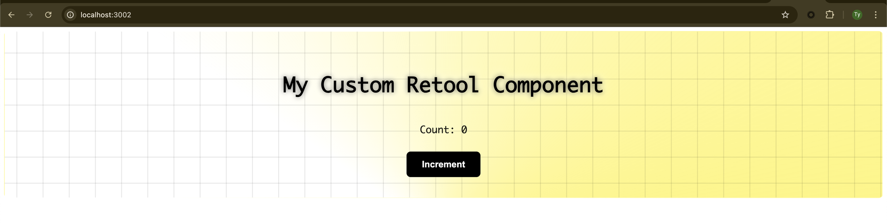

### 3. Get Retool Admin permissions

If you don't have them already, you'll need admin permissions in your Retool instance to create and deploy custom component libraries

### 4. Initialize your Retool component library

From the repo root, run:

```bash
npm run init
```

Select "Log in to your own self hosted Retool instance" and paste your Retool URL (e.g., `https://your-company.retool.com`).

Then go to your Retool instance's Settings → API (`https://your-company.retool.com/settings/api`) and create an access token with read and write access to Custom Component libraries, and paste it in.

Finally, name your library and give it a description.

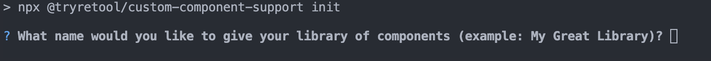

The component library name (e.g., "MyCustomComponents") will show up in Retool's component search:

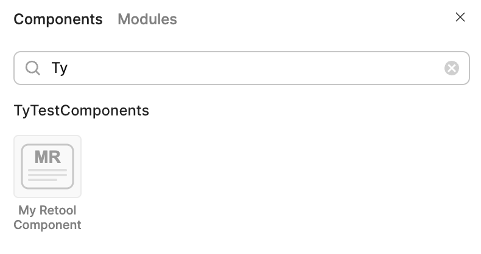

### 5. Prepare for deployment

When you're ready to deploy your component, uncomment the Retool import line in `src/MyRetoolComponent.tsx` to use Retool's state binding library. This will allow any state variables created via `Retool.useState…` to be referenced in other components in the same Retool dashboard.

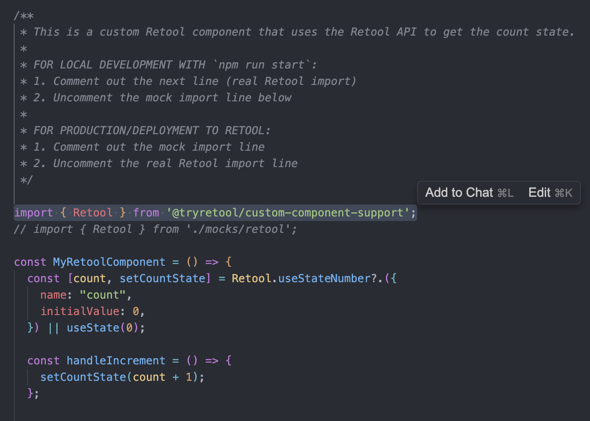

```typescript
import { Retool } from '@tryretool/custom-component-support'
// import { Retool } from './mocks/retool';
```

### 6. Deploy your component

Now deploy your component by running:

```bash
npm run deploy
```

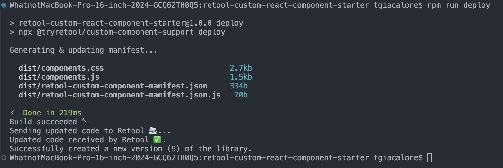

### 7. Use your component in Retool

Go into your Retool app and search for your component:

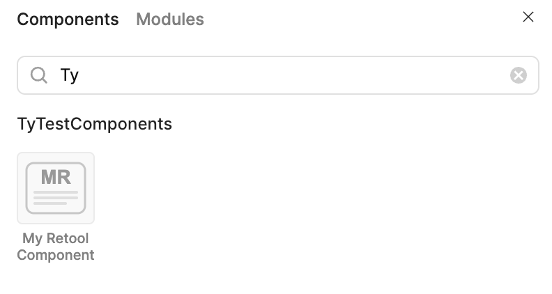

Drag and drop your component into your dashboard:

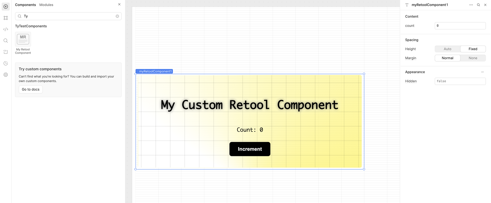

You can now use your component as well as reference the state variables you exposed via the `Retool.useState…` methods:

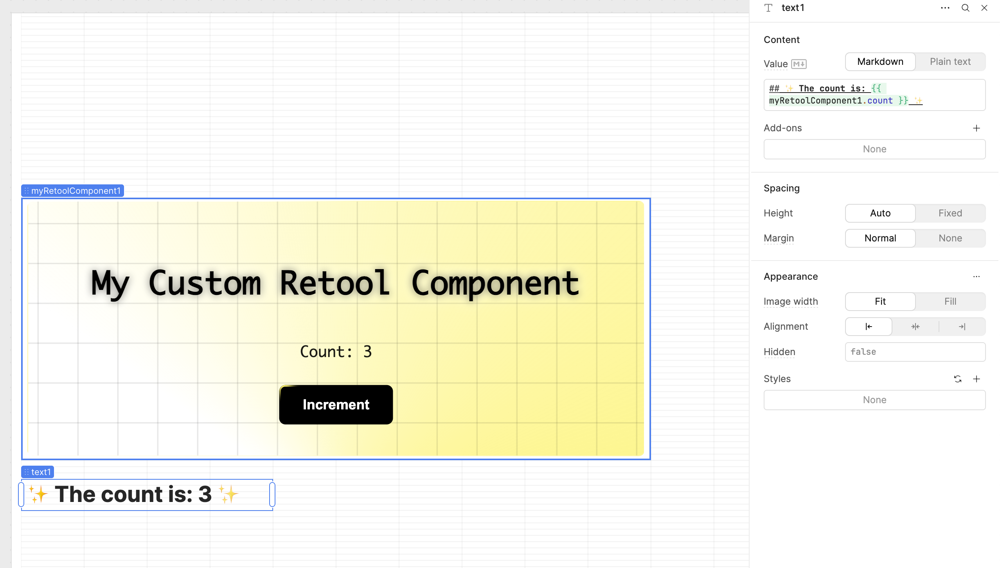

### 8. Update your component

If you make a change to your custom React component, run `npm run deploy` again, refresh the Retool page, then select the latest version of your component:


That's the basics! For more advanced topics like making API calls from custom components via Retool queries/scripts, see below.

## Development Setup

### Local Development

For local development, the project includes a mock implementation of the Retool API:

1. Open `src/MyRetoolComponent.tsx`
2. Comment out the Retool import and uncomment the mock import:
   ```typescript
   // import { Retool } from '@tryretool/custom-component-support';
   import { Retool } from './mocks/retool'
   ```
3. Start the development server:
   ```
   npm start
   ```

This allows you to develop and test your component without needing to connect to Retool.

### Building for Retool

When you're ready to use your component in Retool:

1. Open `src/MyRetoolComponent.tsx`
2. Uncomment the Retool import and comment out the mock import:
   ```typescript
   import { Retool } from '@tryretool/custom-component-support'
   // import { Retool } from './mocks/retool';
   ```
3. Build the component:
   ```
   npm run build
   ```
4. Deploy to Retool:
   ```
   npm run deploy
   ```

## Available Scripts

- `npm start` - Start the development server
- `npm run build` - Build the component for production
- `npm test` - Run tests
- `npm run login` - Log in to Retool
- `npm run sync` - Sync changes to Retool during development
- `npm run deploy` - Deploy the component to Retool
- `npm run init` - Initialize a new Retool component

## Project Structure

- `src/MyRetoolComponent.tsx` - The main component file
- `src/MyRetoolComponent.css` - Styles for the component
- `src/mocks/retool.ts` - Mock implementation of Retool API for local development
- `src/index.tsx` - Entry point for local development
- `src/retool-entry.tsx` - Entry point for Retool deployment
- `public/` - Static assets
- `dist/` - Built files for deployment

## Customizing the Component

To customize the component:

1. Modify `src/MyRetoolComponent.tsx` to add your own functionality
2. Update styles in `src/MyRetoolComponent.css`
3. Add additional state using Retool's state management hooks:
   - `useStateBoolean`
   - `useStateNumber`
   - `useStateString`
   - `useStateEnumeration`
   - `useStateObject`
   - `useStateArray`

## Using Retool State Management

This starter uses Retool's state management through hooks. In the counter example:

```typescript
const [count, setCountState] = Retool.useStateNumber?.({
  name: 'count',
  initialValue: 0
})
```

This creates a state variable that is managed by Retool, allowing the state to be accessed and manipulated from the Retool interface.

## Making API Calls

Exposing custom component state is relatively simple (use `Retool.useState…` methods, as seen in the examples above).

In this section, we'll cover how to make API calls which will execute some code outside our custom React component (e.g., some Retool query/mutation, execute some script in your Retool dashboard, etc.) then return data to our custom React component.

### How To

#### 1. Expose an event callback

Expose a new "event callback" in your custom React component to your Retool dashboard:

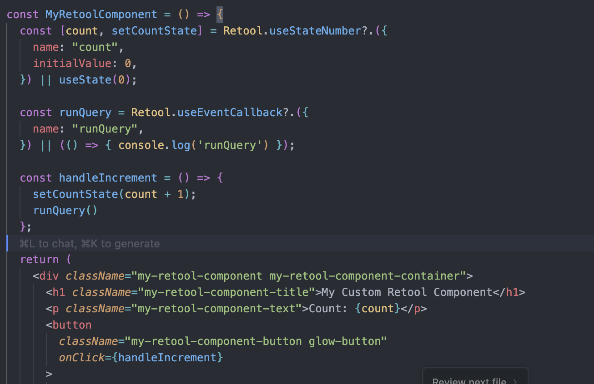

```typescript
Retool.useEventCallback({
  name: 'runQuery',
})
```

#### 2. Deploy and update

Deploy your change to Retool via `npm run deploy`, refresh Retool, then select the latest version of your component:

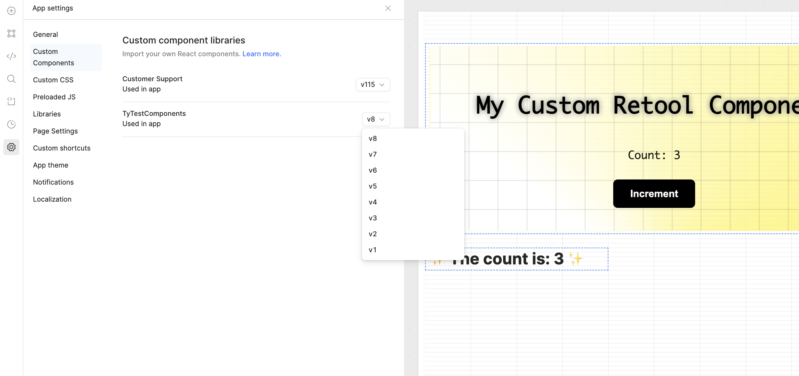

#### 3. Configure event handler

You should now see the `Event handlers` section show up in the "Inspector" when selecting your component in Retool:

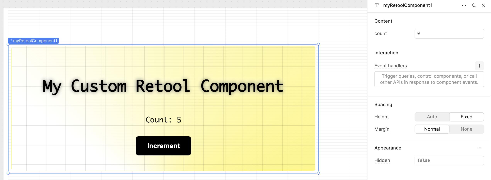

Add an event handler to handle the `runQuery` event you just exposed and choose the query, script, etc., that you want this event to run in Retool:

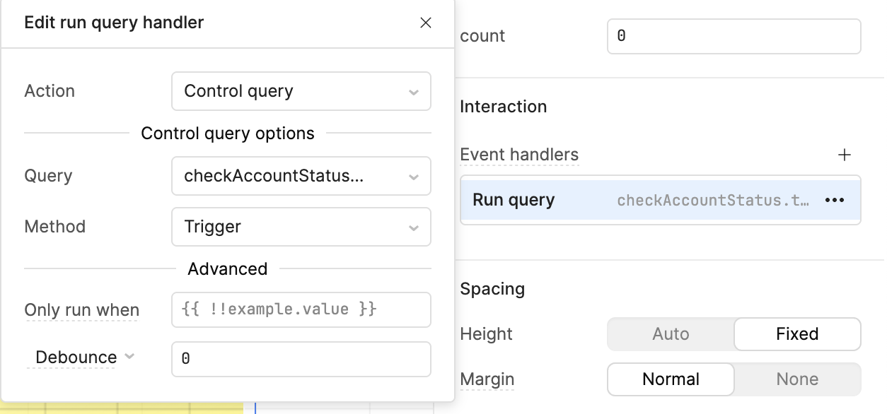

#### 4. Create state object for results

If you need data to be returned from the Retool operation, create a new `stateObject` variable on your component which you'll use to store the operation result and pass it to your custom component.

For this example, let's assume we're saving some data in a variable called `customerStatus`:

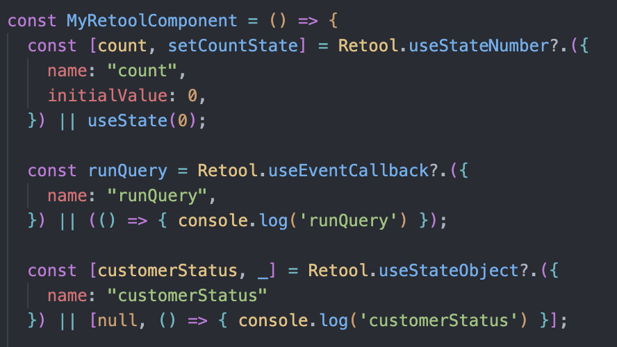

```typescript
const [customerStatus, setCustomerStatus] = Retool.useStateObject?.({
  name: 'customerStatus',
  initialValue: {}
})
```

#### 5. Deploy and configure result passing

Deploy your changes via `npm run deploy` and update your component version in Retool.


Select your custom component and pass the result of your Retool operation by setting the value of the `customerStatus` state object:

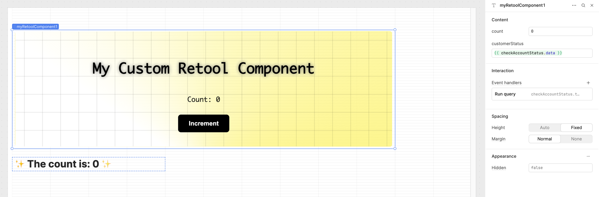

#### 6. Listen for changes

Retool operations are performed async relative to your custom React component, so you'll need to monitor for changes on this variable. In the example below, we can listen for changes on the `customerStatus` value and store it in a `customerStatusRef` object:

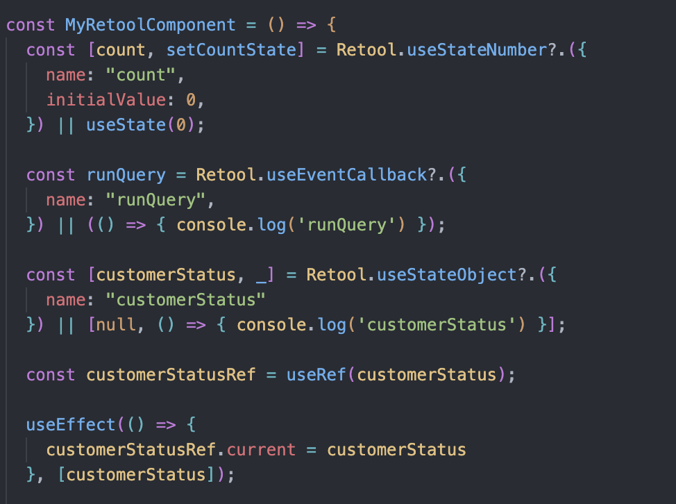

```typescript
const customerStatusRef = useRef(null);

useEffect(() => {
  customerStatusRef.current = customerStatus;
}, [customerStatus]);
```

#### 7. Implement polling/timeout approach

Unfortunately there is no support for direct callbacks on Retool state changes, so to fetch the result of our operation from within our custom React component we'll use a polling or timeout approach that will look something like this:

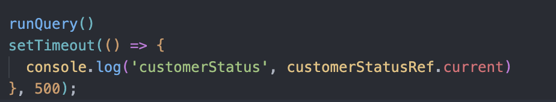

```typescript
const waitForResult = async (timeoutMs: number) => {
  const startTime = Date.now();
  while (Date.now() - startTime < timeoutMs) {
    if (customerStatusRef.current) {
      return customerStatusRef.current;
    }
    await new Promise(resolve => setTimeout(resolve, 100));
  }
  return null;
};

// Usage
const result = await waitForResult(5000); // Wait up to 5 seconds
```

### How it works

The flow is:

1. We trigger an event in our Retool dashboard from our custom React component called "runQuery"
2. Our "runQuery" event is handled in our Retool dashboard to make some operation (query/mutation, call some script, etc.)
3. The result of our operation is passed into our custom React component via the `customerStatus` state object
4. We add a listener on changes to the `customerStatus` object and store it in a `ref` variable in our custom React component
5. We wait X ms for the above async operation to complete and update our `ref` variable, then we read the `customerStatusRef.current` value

## Additional Resources

- [Retool Custom Component Libraries Documentation](https://docs.retool.com/apps/guides/custom/custom-component-libraries/)
- [Retool Custom Component API Reference](https://docs.retool.com/apps/guides/custom/custom-component-api)
